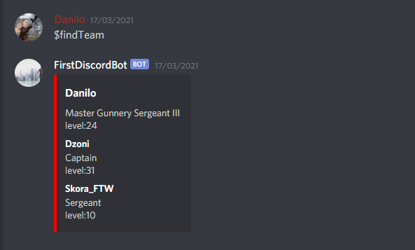

# Matchmaking-Discord-Bot

## About

Discord bot that make teams in Call Of Duty:Warzone based on player ranks and levels.

## How to install
1.Clone project  

2.Npm install in your directory 

3.Open main.js and write information about your bot and server where needed 

4.Open your server and run node main.js 

## Commands
$addPlayer <Player Name> <Player Call Of Duty Name and Tag> - adds player to database 

$findTeam - finds team based on player ranks and levels

### Enjoy
### Danilo Mandusic
